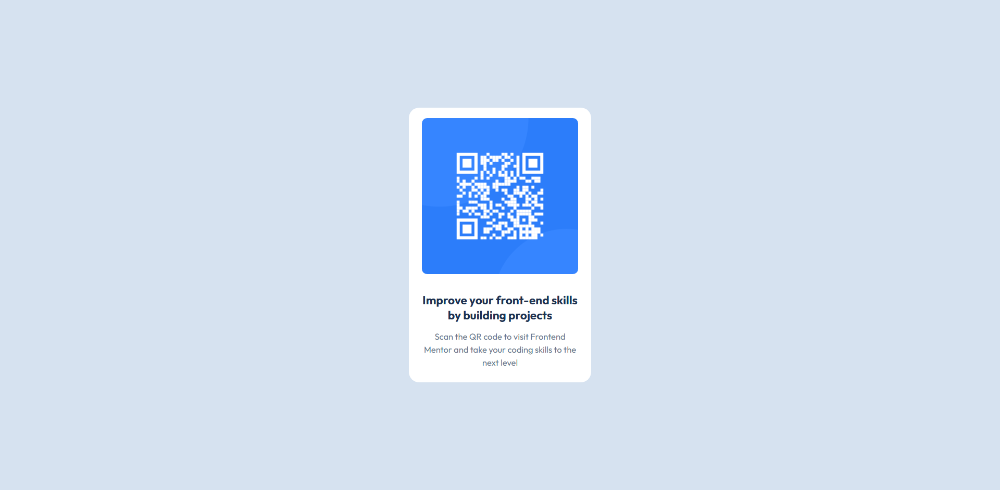

# Frontend Mentor - QR code component solution

This is a solution to the [QR code component challenge on Frontend Mentor](https://www.frontendmentor.io/challenges/qr-code-component-iux_sIO_H). Frontend Mentor challenges help you improve your coding skills by building realistic projects. 

## Table of contents

- [Frontend Mentor - QR code component solution](#frontend-mentor---qr-code-component-solution)
  - [Table of contents](#table-of-contents)
  - [Overview](#overview)
    - [Screenshot](#screenshot)
    - [Links](#links)
  - [My process](#my-process)
    - [Built with](#built-with)
    - [What I learned](#what-i-learned)
    - [Useful resources](#useful-resources)
  - [Author](#author)


## Overview

### Screenshot



### Links

- Solution URL: [Add solution URL here](https://your-solution-url.com)
- Live Site URL: [Add live site URL here](https://your-live-site-url.com)

## My process

### Built with  
- Flexbox


### What I learned

I learned about flexbox in CSS. At first, it was difficult to understand how it worked and how I could apply it.  

My code snippets

```css
#container {
  display: flex;
  flex-direction: column;
  width: 350px;
  background-color: var(--color-1);
  border-radius: 20px;
}
```


### Useful resources

- [CSS Flex Container](https://www.w3schools.com/css/css3_flexbox_container.asp) - This helped me for flexbox reason. I really liked this pattern and will use it going forward.
- [CSS Flexbox](https://www.w3schools.com/css/css3_flexbox.asp) - This is an amazing article which helped me finally understand flexbox. I'd recommend it to anyone still learning this concept.

## Author

- Website - [Martijn](https://www.your-site.com)
- Frontend Mentor - [@desk-dev](https://www.frontendmentor.io/profile/desk-dev)